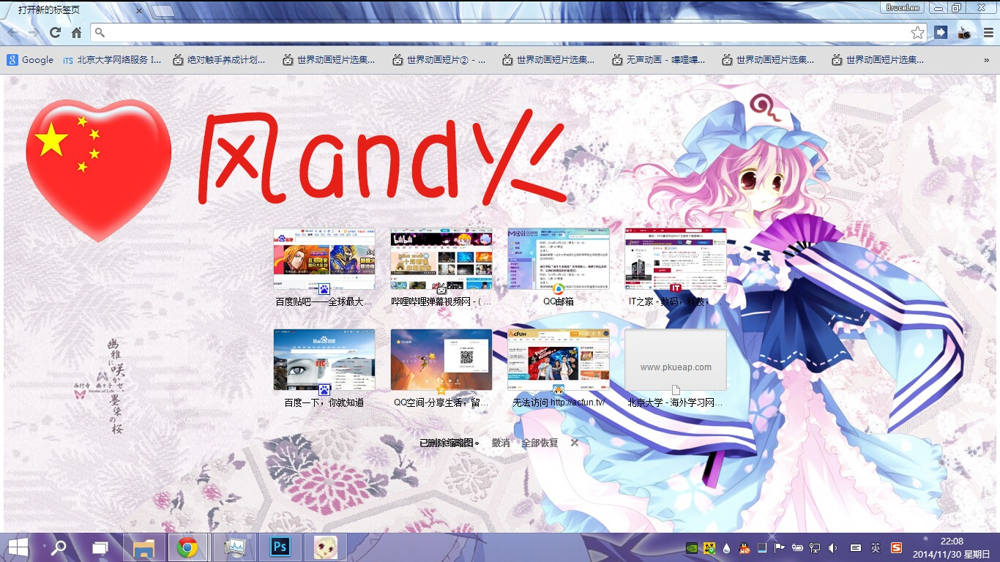

[**下载地址**](../file/0004.7z)

利用[Chrome Theme Creator](http://windfire007.com/ChromeTheme/)制作的第一款皮肤，刚开始学美化时，以幽幽子为主题制作出来的chrome皮肤。第一次制作，考率到浏览器大小的缩放，空白页中间的快捷链接的遮挡等等，选素材还是选了一阵子的。而且由于我当时用的电脑分辨率是1366×768，所以制作的时候根本没发现在高分辨率屏幕上用不了这件事。。。

下载解压后是个.crx文件，直接拖进chrome浏览器里即可。由于自创皮肤不能随账号同步，所以请自行备份一下。

预览上面的中国心是我加上去的水印啊……

背景素材取自[id=6768049](http://www.pixiv.net/member_illust.php?mode=medium&illust_id=6768049)，标题栏素材取自[id=29154484](http://www.pixiv.net/member_illust.php?mode=medium&illust_id=29154484)。