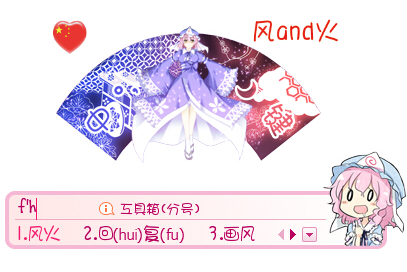

[**下载地址**](../file/0006.zip)

本人制作的第一款搜狗输入法皮肤，刚开始用学美化的时候顺手作的。当时整个电脑的主题都是幽幽子。不过第一次做确实还是比较麻烦的，按钮什么的当时还是想了好久，不过做出来效果也很满意，问题还是状态栏有点大了。

预览上面的中国心是我加上去的水印啊……

和chrome的皮肤不一同的是，自创的皮肤可以同步。

输入框素材取自[id=26880656](http://www.pixiv.net/member_illust.php?mode=manga&illust_id=26880656)的第60张。状态栏素材取自[id=5028834](http://www.pixiv.net/member_illust.php?mode=medium&illust_id=5028834)，不过刚才查看的话，图片已经被删了，那就再附上[Konachan链接](http://konachan.net/post/show/62705/cherry_blossoms-fan-hat-japanese_clothes-kimono-pi)。

皮肤用的字体建议也下载了，要不系统默认的字体太难看。字体直接双击打开就能安装。

[华康少女文字W5](../file/0000.zip)

[Buxton Sketch](../file/0001.zip)