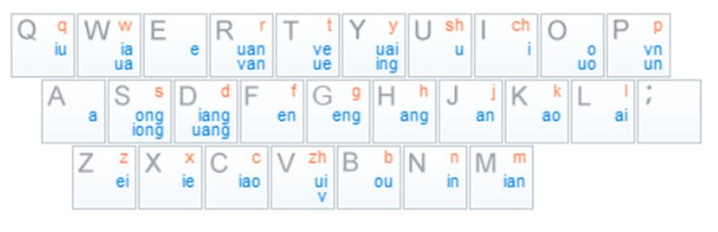

双拼，顾名思义，每一个音都由唯一的两个字母组合表示。相比于我们平时用的全拼，双拼大大简化了全拼需要输入的字母数量。不过既然是所有的音都用两个字母表示，那么原来只用一个字母表示的音，例如啊、饿、哦等，也要用两个字母来表示，不过相比而言，整体上还是缩短了输入。

先放上[双拼的百度百科](http://baike.baidu.com/link?url=346b_CPLxEzB-IyD0qcceesbUv9AH-bZvqGMFvczZvP_lwH7nuFii_bmVB8hThJ2T9SPNISp56ciQXsXWI0W9APOj4IL1cdb7Qh8a5EoZyW)。我开始接触双拼是因为[@Gnoliyil](http://space.bilibili.com/7119/)，他打字总有些迷之手误，之后才知道是因为双拼的原因。于是我也开始学习了双拼，简单地说，为了让每个音都能用两个字母表示，而且也要符合人们对拼音的习惯，所以将多字声母或者韵母映射到别的键位上去。这样对于任何由声母+韵母而组成的发音，都可以表示成AB，A是声母，B是韵母。而对于无声母的音，不同双拼方案有不同的做法。我之前用的搜狗双拼是采用的将o作为无声母音中的声母，用o+韵母来表示。而我现在用的自然码，则是原本两个字的韵母不变，单字韵母双写表示。

对于不同的双拼方案，多字声母和韵母的映射方案都有所不同，无声母的音方案也不同。我这里主要以我现在正在用的自然码方案作为讲解，自然码也是最为主流的双拼方案，很多其它方案都是在自然码的基础上修改的，例如微软双拼或者搜狗双拼，都和自然码大同小异。我之前用的搜狗双拼的差异会在后文说出。



先发上来自然码的映射方案，这种映射主要依靠的是，汉语拼音并不是任意声母韵母组合都能存在的。使一个字母可以表示一个声母和几个韵母，其中几个韵母利用不是所有音都存在而保证唯一性。由于双拼是有严格顺序，每个字都是两个表示，所以一行字输入下来，他会强行两个两个断开识别声母韵母。利用这个映射表，外加之前说的无声母的音的规则（双韵母则不变，单韵母则双写）就可以开始打字了。

```
yb'yu'yb'yi'dy'de'yy'ue'gr'xi'aa
由 于 有 一 定 的 映 射 关 系 啊
so'yi'yy'ue'bc'hl'ui'xu'yk'rf'vf'de'ji'vu
所 以 映 射 表 还 是 需 要 认 真 的 记 住
gh'kl'ui'ke'ng'xu'yk'yi'ge'yi'ge'ia'bc
刚 开 始 可 能 需 要 一 个 一 个 查 表
dj'ui'ys'jq'le'hb'jq'ng'kk'bf'ng'ji'vu'le
但 是 用 久 了 后 就 能 靠 本 能 记 住 了
er'qx'su'du'qt'ui'ng'uk'yb'ti'ug
而 且 速 度 确 实 能 稍 有 提 升
```

以上就是一个双拼的例子，基本上覆盖了之前主要说的几个规则。

当然的双拼也有很多缺点啊：

* 容错度太差，由于音是有严格顺序的，所以如果中间少打一个字母，就会导致后面全盘皆错。而且由于音的定位太过于准确，所以手残输错的话，会错的离谱。当然这也是效率高的弊端，高效率的压缩必然需求高精准度。就我个人使用来说，长句子出错率确实挺高，而且大部分输入法没有对双拼进行专门的优化，也导致了纠错率几乎为零。
* 而且双拼让我抛弃了在手机上用了十多年的九宫格输入法……虽然说双拼也可以用九宫格输入法吧，但是用起来就是莫名的别扭。
* 相信很多人都有一个经历，那就使用输入法时不小心按了空格外的其他键，例如按了shift 、回车这种，在输入法里的英文会直接打入要输入的地方。或者是忘记自己没开中文，直接输进去英文拼音。对我来说这种时候往往出现在搜索栏里，如果用全拼的话，弄错了拼音输入进去，搜索引擎还是能认的，对搜索并没啥大碍，但是双拼就不行了……
* 并且由于我们一开始就学习的是全拼，对全拼印象太深，导致双拼更像第二语言似得，大脑内还是需要有一个转换。和之前说的容错太差一样，如果我拿双拼打一行拼音的话，你要是想认出来，需要很细心的两个两个断开，这就不像全品那样长短不一的拼音，靠几个声母就能断句，在双拼里你看到声母那可不一定是声母。

不过说到底，双拼确实不宜推广，因为其有一个学习成本，大部分人是不会去投入这个时间去学习的。而且刚学习的时候，打字效率会大大降低，让人十分受不了，甚至用回全拼。我当初拿双拼写作业真是挺痛苦的，动不动就用回全拼。不过通过QQ的聊天，慢慢打字，逐渐熟练了双拼。

具体如何使用双拼呢，基本上我们主流使用的中文输入法——搜狗输入法和QQ输入法都在设置里可以选双拼，然后也可以选双拼方案，还是推荐使用自然码。当然这俩的手机输入法也都可以双拼。百度输入法应该也可以。windows自带的输入法只有微软自己的微软双拼。ios原生输入法不支持，只能装第三方。

不过自己使用双拼的话，别人想用设备的话，可能就比较麻烦了，我是还保留着原生全拼输入法来当做替代品。话说回来，因为双拼普及度不高，用双拼其实可以加密啊233333，不过自己读起来也比较累，还容易出错。本网站的链接啊，基本上能用英文就是英文，用中文的话也是那双拼打出，例如本文链接 <http://windfire007.com/udpn/> ，udpn就是双拼的双拼（绕口啊

最后说说搜狗双拼，由于搜狗双拼是搜狗输入法默认的双拼方案，所以包括我在内的很多双拼使用者，都会用搜狗双拼，我也是使用了很久。搜狗双拼和自然码主要区别有：

* 最最最主要的区别在于`;`键上，搜狗双拼用`;`键表示ing这个音，手机上则使用分词建表示。'樱'需要输入p;
* 还有就是把v和ü强行分开，ü映射到y上了。'女'需要输入ny
* 之前说过的无声母的音，其选择用o代替无声母的声母，例如'安'则需要用oj表示，为此还专门把er映射到r上，'而'这个音用or表示。这也造成了我打这些音习惯性先按o……

总体来说搜狗输入法实在不够人性啊，多一个`;`键，而且手机上分词键和电脑上`;`键位置差太远。v和ü的拆分简直不能忍，本来就两个字母的韵母也要强行映射这种……当然输入法方案不止这两个，还有各式各样的，也可以自定义，主要看自己的习惯了。我是选择随大流用自然码。

嗨呀，我还真写了这么长的文章啊……