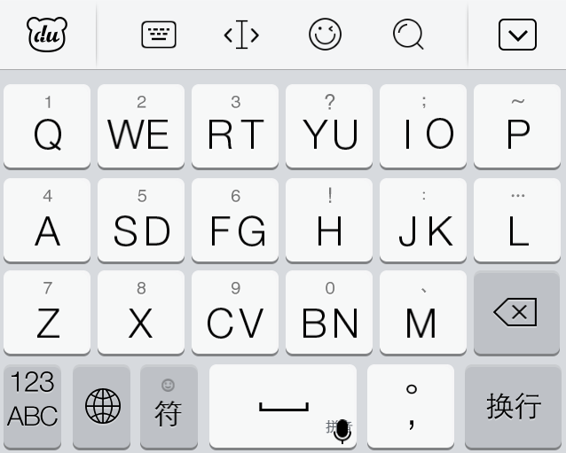

[**下载地址**](../file/0008.zip)(iOS版)

在小屏幕的手机上，全键盘打字很别扭，按键太小导致十分容易误触。对于双拼输入法，九宫格键盘使用起来也很别扭，重码率实在太高。很不巧，我就是小屏幕的双拼使用者。

为了解决这个问题，便有了双键的键盘。顾名思义，就是一个按键对应两个字母，这样既扩大了按键大小，也降低了重码率。双键键盘按照字母顺序分为两类，一类和普通的键盘字母顺序一样，另一类通过重新排列来最大可能的降低重码率。不过相对而言，乱序键盘会有一定的学习成本。还可以按照按键个数来分类，主流的是14键键盘和17键键盘。

在网上找到了一个百度手机输入法的17键皮肤，名字叫做`十七键IOS7`，具体作者我也不太清除。之后对于按键进行了一些修改以供自己使用。具体修改如下：

1. 去除了中文输入法的所有下滑按键。

2. 把中文输入法左滑右滑按键全部改成了标点，并优化了排序。之前左滑右滑大部分都是对应按键的字母，然而实际使用中这样并没有用处。上滑按键并未改动，请参考键盘上的标识。以下是对应表，前者为左滑，后者为右滑，边缘按键只有往里的滑键：

   ```
   Q: →
   WE: 【 】
   RT: # &
   YU: % *
   IO: + =
   P: ←
   A: @
   SD: （ ）
   FG: 《 》
   H: ‘ ’
   JK: “ ”
   L: '
   Z: ·
   X: / \
   CV: < >
   BN: _ -
   M: , .
   ```

3. 交换了中文输入法中符号和表情的位置、句号和逗号的位置。

4. 英文输入法补全了四种括号，分别置于K、L两按钮的四个滑动方向。`：`下滑增加了`;`，原输入法`_` 下滑为`-`。

5. 链接输入以及邮箱输入删除了`.edu`以及下滑按键。


百度的这个皮肤编辑器明显比之前用过的搜狗的功能要强大很多，然而并不如搜狗的好用。由于功能很多很复杂，所以我也只是修改了最基础的东西，其实还有很多地方不太满意。以及，也不知道是百度输入法的bug还是皮肤的bug，在chrome地址栏中直接输入中文，经常点击回车没用。