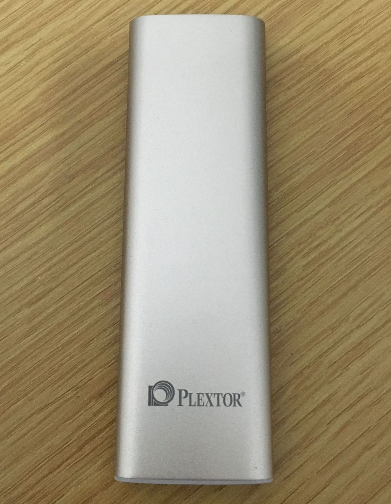

很久没写博客了，本来一直想写一篇文章总结一下今年暑假的，不过还是先说说这几天装linux的事吧。暑假的文章先安排个[链接](http://windfire007.com/lvyb2017/)，等会有空了再写。

又突然中二的想用linux了。当然了，我还是使用的linux mint，一个基于ubuntu LTS的发行版。

在半年前，给舍友装linux时，一开始先是装的虚拟机，不过貌似他不太满意。再后来我建议他买个移动固态硬盘，直接装到移动硬盘里，当作便携的linux用。于是他买了一块浦科特的固态移动硬盘，给他装系统时，一开始只读出了一块硬盘，还以为不能安装到移动硬盘里，最后发现是读不出电脑内置的磁盘。各种害怕，以防万一的还让他把电脑里的资料都考出来备份了一份。由于只能读出移动硬盘一个磁盘，所以安装的很顺利，一路默认就好。最终装完之后，设置的优先启动usb引导，这样就很完美了。开机的时候插上移动硬盘就是启动linux，不插就是win。

因为在舍友的电脑上安装得很成功，他使用这么久也没说有什么问题。所以我也弄了一块同款的移动固态硬盘，想着把linux装到移动硬盘上，这样就可以不破坏我本来的笔记本了。但是、但是，差距还是比较大的。

首先出现的问题就是，在我电脑上，竟然能认出来内置的磁盘。当然这并不是一件什么意外的事，本来就应该能认出来，要么怎么给电脑刷系统呢？这样我要装到移动硬盘里就需要手动分区了。以前装linux时都是在只有一块磁盘的电脑上安装，直接默认分区就好。然后就是先学习一下如何分区，开头一个/efi，最后一个/swap，中间的全部都是/，这应该就是最简单的分区了，其余的我也不需要什么。不过这样手动分区竟然分不干净，前后都剩了30M左右。swap分区其实我觉得也没必要了，毕竟16G内存，但是想了想以防万一还是分了一个和内存一样大小的swap分区，毕竟如果没有swap分区的话会弹出警告。

由于安装程序读出来了内置硬盘，那么也就检测出来了硬盘里还装着windows10。对于双系统来说，先装win后装linux，就会由linux来引导双系统。这样电脑默认的启动项就是linux了，所以重启时没有插移动硬盘的话，会直接进入黑屏卡死。导致我又要进入bios把win的启动项调到最优先，查了查网上很多人都遇到这问题，不过难道他们连调启动项顺序都不懂吗……这个和舍友的电脑差距也挺大，在他电脑上安装的时候，因为没有检测出已经安装了win10，所以没有增加双系统引导，也就没有其余的什么事了。完全就是个独立的linux，所以他的电脑可以完全把linux当做u盘启动。而我这个linux启动项直接写进了内置磁盘的efi中，导致现在都删不掉，这个一会再说吧。

装好了linux后，进入系统遇到的第一件事就是蓝牙鼠标要重连。这样子我猜也猜到了一会儿到了win下鼠标也要重连，果不其然只能连接一个，也就是说每次切换系统都要重新连接蓝牙鼠标，然后断开与原系统的连接。这就很蛋疼了，我之前的蓝牙键盘是可以同时连接三台设备，如果用在这里应该没事吧，但是蓝牙鼠标可没有能同时连接三台的啊。网上能查到解决办法，不过太麻烦了我也懒得弄，然我就把之前的有线鼠标拿了出来，至少先把鼠标的问题解决了。不过这神船的usb插口实在太少，还必须要用usb hub。

回到原来的win，发现电脑时间不对了，一下晚了8小时。查一查才知道这是因为linux和win计算时间的方式不一样：电脑硬件的时间，win是直接当做LT用，也就是地方时；而linux是当做UT用，也就是世界时，既格林威治时间。例如现在是北京时间20点，那么在win下，硬件时间就是20点。而到了linux下，硬件时间当做是UT，所以LT是第二天4点，这时间就不对了，之后linux同步时间往前调8小时，LT变回20点，而硬件时间也就是UT则变成了12点。再回到win，win直接把硬件时间当做LT，所以显示出现在是12点，只能等同步时间再同步回20点。反反复复总是让人心烦，当然了在网上也能找到解决办法，不过我试了一下并没有成功，可能是哪块按错了吧。

行，先不管时间了，分辨率总要调吧。由于笔记本1080P一般都会选择缩放125%或者150%来使用，而linux mint只有200%这一个选项，这看起来更蛋疼。于是干脆直接调分辨率，调成1600*900的，但是在调的过程中，从大往小调没啥事，再调回去就直接卡死没反应了。弄得我只能ctrl+alt+F1然后reboot，这重启还有问题我一会再说。linux mint自带的显卡驱动屏幕还时不时会闪一下黑点，不过装了N卡的驱动后倒是没这问题了。

说到重启的bug，那就是在linux下重启会直接卡死，就好像之前说的没调启动项时不插硬盘开机一样。我连按F2进入bios的机会都没有，只能断电再开机。那么直接关机呢会咋样，嗯，很正常的关机了，然后再开机默认进入win后，过上几秒电脑就突然断电了，WTF？开机开一半断电了？这是关完机立马开机才会遇到的情形，如果等的时间长一点就没有这问题。估计是关机还没关彻底呢，就可以开机了，但是开机时之前那个关机命令还在进行、唉。。。

不管怎么说还是要正常使用的吧，首先浏览器对我来说就是必须的，按装chrome后，apt-get准备更新，然后就卡死了，卡在了刷新google的源上。这就蛋疼了，因为我在linux下没法翻墙，ss不像其他平台一样那么无脑。因为在前年尝试失败了，所以这次我干脆也没再去尝试，马上就因为下一件事放弃了这个linux。

因为等明年我需要在台式机上使用linux，所以就想看看这个移动硬盘便携linux能否在其他机器上使用。找同学借了个台式机，在boot里看不到linux启动项。再加上上面种种的问题，不干了，直接把硬盘格式化，不玩了啊。事后再想想，可能是那台电脑没开usb启动，毕竟dell的整机还是有这个可能性的。

硬盘都格式化了，但是启动项还在那啊。先装win再装linux，linux就会直接在win的efi里写入启动项，在boot里面还是两个ubuntu。想删吧，又不敢直接用DiskGeniu进入efi分区删除，因为我真害怕出了什么差错。所以下载了一个EasyUEFI，准备用这软件来管理启动项。不过最后也没删掉，也就是原本有两个ubuntu，现在只有一个了。算了算了不管了，反正我平时也不进bios，眼不见心不烦，等有空格盘重装再说吧。

还是像以前一样直接用虚拟机吧，默默地去下载vmware。

于是乎，我现在多了两块硬盘。一块是以前存备份的500G机械硬盘，脑袋一热给格式化了，本来是想着试一下格式化成ext4给linux用。还有就是这个装linux的移动固态硬盘，唉，一下子这块硬盘没啥用了啊，我又不存东西，唯一能想到的用处就是拿来给win和mac之间传输资料，毕竟是SSD，而且容量比我那个16G U盘大多了。不过在mac下试了试格式化硬盘，不管哪种格式HFS+、FAT32、exFAT、APFS都会在开头创建200m的efi分区，这就很烦了，因为在win下磁盘管理没法删除efi分区，必须使用命令行才可以。来纪念一下这个没什么卵用的移动固态硬盘吧。

# 说这么多都是废话，这些吐槽抱怨有个P用，完全就是因为我这个电脑小白P都不会用。我妄想用linux到底是为了啥？为了易用性？做梦吧。linux本来就是一个需要自己动手解决问题的系统，怎么可能啥问题都遇不到。还希望系统能自动化人性化易用一步到位，抱着这种心态这辈子用不好linux。