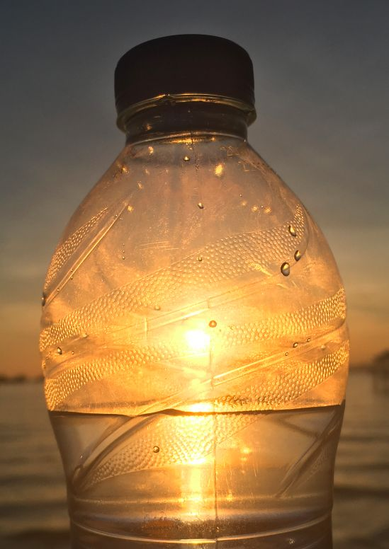

这次旅游啊，那可是计划了很久，最早可以从12年开始算起，当时由于种种原因而终止了。

世界那么大，我想去看看。

这次的计划是一路向南，时间整整一个月。

感慨万千不知该从何写起啊，感觉什么话都说不出来，也不想贴太多的照片。

一路上最美的景色就属九寨沟了，如果人间有仙境的话，那么一定在九寨沟。

川渝地区的美女真多啊，简直天堂，等老了，可以来此处安享晚年。

从小生在内陆长在内陆的我，第一次看到大海，蔚蓝的大海，广袤无垠的大海，这种心情完全不知道该如何形容。

北上广都去过的我一直没觉得这些大城市有多么的繁华，而这次是真的明白了什么是灯红酒绿，原来自己的家乡真的有这么落后。

当然，这趟旅行的预算也严重超支，计划和准备可以说是完全随性，可能用得上的东西那就等于用不上，一切从简。

一个人的旅行，如果不信任任何人的话，那么也未免太过痛苦，所以也早就做好了被骗的准备。

一直期望并且选择离开学校的环境，这次终于长大成人了。

不同圈子中的人，他们眼中的世界完全不一样，在这广阔的土地上，什么样的圈子都会有。

人穷，见识不能穷。一个人的视野如果只有自己的小圈子，那么他一辈子的上限也就如此。正因为穷，才需要多出去走走，见见大千世界是如何，才能明白自己更应努力。

**原来，中国那么大！**

争取三年内能够出国看看，这个世界可不止这么一点。

*拍摄于三亚，2017年8月*