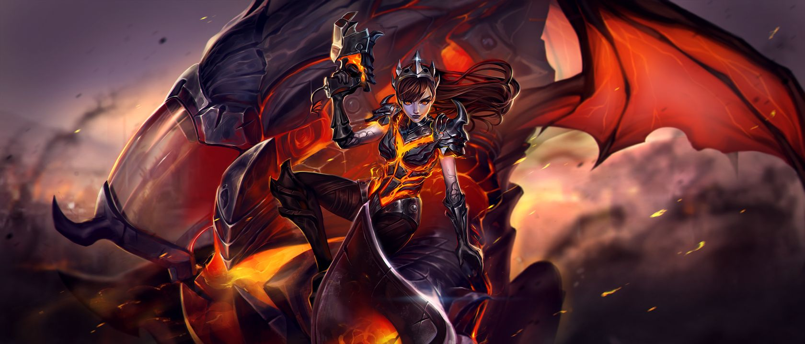

前几天《风暴英雄》中D.Va出了个[新皮肤](http://heroes.blizzard.cn/article/blog/7251)，这个皮肤看起确实好看，还配了一张壁纸，就是上面这个图。这个壁纸画风很是喜欢，但是国服这个图分辨率太差，然后听说[美服](http://us.battle.net/heroes/en/blog/21072296/all-shall-burn-beneath-the-shadow-of-dva-the-destroyer-10-3-2017)有高清大图。于是去美服找到大图，是21:9的宽带鱼，然后顺手拿[waifu2x](http://windfire007.com/waifu2x/)放大成4K分辨率了，也就是5040*2160。拿来做壁纸应该很不错，不过我既没有4K显示器，也没有21:9的显示器。

[**美服原图**](https://bnetcmsus-a.akamaihd.net/cms/content_folder_media/SJMTEE2YY5T91506381365048.png)

[**4K宽带鱼**](../file/0009.7z)

不过国服倒是有一张动图也挺漂亮，不过由于是gif，我就不期望能高清了。直接放原链接好了：

